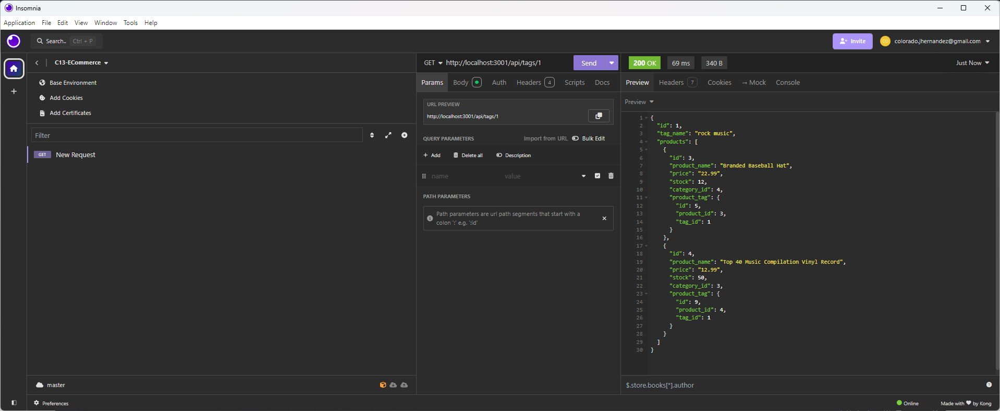
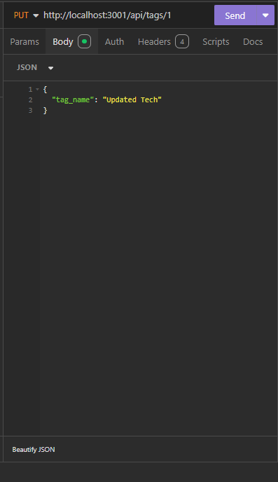
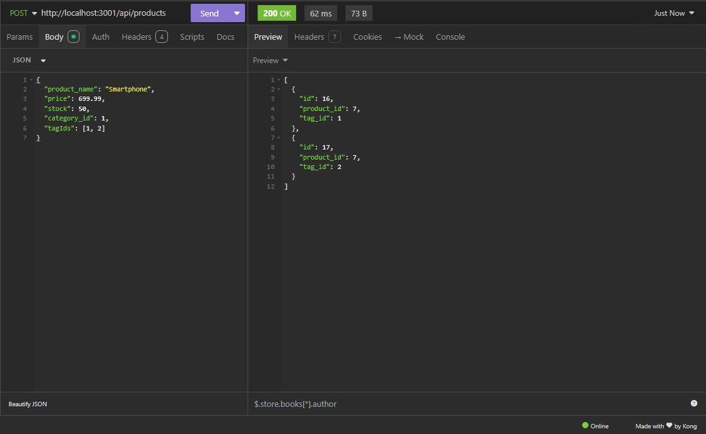

# C13 - E-Commerce README

## Description

This project is the back end for an e-commerce site, built using Node.js, Express.js, Sequelize, and PostgreSQL. The application manages product categories, products, and tags, enabling users to perform CRUD operations on each of these entities. This project serves as a demonstration of setting up a RESTful API with Sequelize as the ORM to interact with a PostgreSQL database.

## Features

- **Easy Data Management**:
  - Create, update, view, and delete categories, products, and tags through a user-friendly API.

- **Product Organization**:
  - Organize products by linking them to categories and tags for better search and filtering.

- **Robust Database**:
  - Uses PostgreSQL for reliable and efficient data storage.

- **Automated Setup**:
  - Quickly set up and populate the database with sample data using a simple seeding script.

- **Error Handling**:
  - Clear and informative error messages help ensure smooth operation and troubleshooting.

- **Secure Configuration**:
  - Sensitive data is protected using environment variables.

## Usage

This application provides a RESTful API for managing product categories, products, and tags. You can use a tool like Insomnia or Postman to test the endpoints.

## Examples

[Demo Video](https://drive.google.com/file/d/1Bv9559CEImrF2O1yHpkrBVSZfoheiT70/view?usp=sharing) <----- View DEMO VIDEO

## Source Code

- Base code provided by: [The Coding Bootcamp](https://github.com/coding-boot-camp/bookish-sniffle)
- Revised by [Mountainmancodes](https://github.com/Mountainmancodes)
- Contributons provided by:
  - [edX Xpert Learning Assistant](https://www.edx.org/)
  - [Lixiviate](https://github.com/Lixiviate)

## License

This project is licensed under the MIT license.